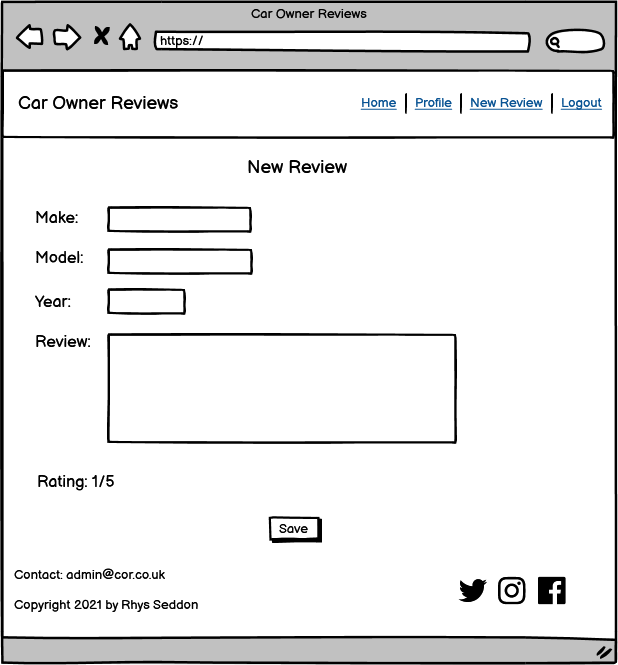
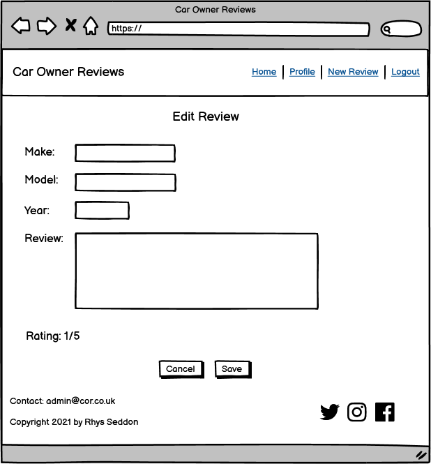
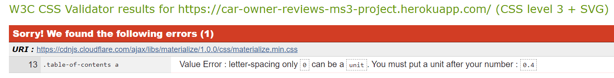

# Car Owners Reviews

## Contents

* [Purpose](#Purpose)
* [User Stories](#User-Stories)
* [UX](#UX)
    * [Strategy](#Strategy)
    * [Scope](#Scope)
    * [Structure](#Structure)
    * [Skeleton](#Skeleton)
    * [Wireframes](#Wireframes)
    * [Surface](#Surface)
* [Features](#Features)
    * [Navbar](#Navbar)
    * [Footer](#Footer)
    * [Home Page](#Home-Page)
    * [Profile Page](#Profile-Page)
    * [New Review Page](#New-Review-Page)
    * [Login Page](#Login-Page)
    * [Register Page](#Register-Page)
    * [Edit Page](#Edit-Page)
    * [Manage Reviews Page](#Manage-Reviews-Page)
    * [Defensive Programming](#Defensive-Programming)
    * [Features To Add In The Future](#Features-To-Add-In-The-Future)
* [Technologies Used](#Technologies-Used)
    * [Languages](#Languages)
    * [Libraries](#Libraries)
    * [IDE and Hosting](#IDE-and-Hosting)
    * [Packages](#Packages)
    * [Tools](#Tools)
* [Testing](TESTING.md)
* [Best Practices](#Best-Practices)
    * [Naming Conventions](#Naming-Conventions)
    * [Code Validation](#Code-Validation)
* [Deployment](#Deployment)
    * [Setup](#Setup)
    * [Heroku Deployment](#Heroku-Deployment)
    * [Cloning on GitHub](#Cloning-on-GitHub)
    * [Local Deployment On Gitpod](#Local-Deployment-On-Gitpod)
* [Credits](#Credits)
    * [Problems Encountered](#Problems-Encountered)
    * [Images](#Images)
    * [Acknowledgements](#Acknowledgements)

The live deployed website can be found [Here](https://car-owner-reviews-ms3-project.herokuapp.com/)

## Purpose

The purpose of this website is to give users an insight into what it is like to own a particular car. 
Cars are one of the biggest purchases people make in their lives and they will normally want to make 
sure they are buying the right one!  
The website will be based on members submitting reviews of cars they own or have previously owned, 
this will give users an impartial view from people who have had the experience of owning the car and 
are not just trying to sell it for a profit.  
The reason for creating this project is for my third milestone project for a software development course
 I am undertaking with the Code Institute.

## User Stories

### Visiting users

As a visiting user I want to:
-	"Instantly understand the purpose of the website."
-	"Be able to swiftly decipher site navigation."
-	"Find out how good a particular car is."
-	"Be able to register and become a member to post my own review."

### Returning users

As a returning user I would like to:
-	"Be able to login and see my profile."
-	"Be able to delete and edit my old reviews."
-	"Write a new review."
-	"Be able to log out again."

### Admin users

As an admin user I require the ability to:
-   "Log in as an admin user."
-   "Delete or edit all member reviews."
-   "Search all member reviews."
-   "Create, edit and delete the makes of the cars."

# UX

## Strategy

As the site owner my goal is to create a place for car owners to share their experience of owning a particular car 
and provide this information clearly to other users of the site.  To achieve this, 
I aim to provide users with the ability to:
-	Add their own reviews.
-	Browse other users’ reviews.
-	Search other users’ reviews.  
The target audience for the site will be:
-	Users that want to inform everyone of how good or bad their car is.
-	Users that are looking to buy a new car and require impartial information.
-	Users who have a general interest in cars.

### User Expectations

The user should:
-	Be able to navigate the site easily.
-	Expect the site to load quickly.
-	Read other user's reviews.
-	Create, read, update and delete their own reviews.

## Scope

Based upon the strategy the features and functionality I want to include are as follows:
-	Car related hero image.
-	A paragraph welcoming the user and explaining the websites purpose.
-	Ability to register, login and logout.
-	A search box where the user can search for reviews.
-	An accordion containing all the reviews so the user can browse through them.
-	An accordion containing the current profile owner's reviews.
-	Ability for the user to create, read, edit or delete their reviews.
-	A form for the user to fill out containing the make, model, year and review text.
-	Ability for the user to rate the car from 0 to 5.
-	A form with the ability to edit make, model, year and review text.
-	A page containing all the makes with options to delete or edit them for the admin user.

## Database

To enable create, read, update an delete functionality the website will require a non-relational data base (No SQL).
The database will have three collections:

### Users

A document of the registered users. 

Key | Value
---|---
_id |ObjectId  
username | string  
password | string

### Reviews

A document of reviews written by the users. Accessible by admin and partially by registered users. 

Key | Value
---|---
_id |ObjectId 
make | string
model | string
year | int
review | string
rating | int
owner | string

### Makes

A document of makes added by admin users. Only accessible by admin.

Key | Value
---|---
_id |ObjectId 
make | string

## Structure

The site will be structured in a linear format keeping the users’ expectations as the main priority. 
It will contain 8 pages each with the same navbar and footer. The layout will be similar across all pages 
to keep a consistent and clean UX.

## Skeleton 

### Wireframes

#### Desktop

Desktop Home (Click for image)

Desktop Profile (Click for image)

Desktop New Review (Click for image)

Desktop Login (Click for image)

Desktop Register (Click for image)

Desktop Edit Review (Click for image)

Desktop Manage Makes (Click for image)

Desktop Edit Makes (Click for image)

#### Tablet

Tablet Home (Click for image)

Tablet Profile (Click for image)

Tablet New Review (Click for image)

Tablet Login (Click for image)

Tablet Register (Click for image)

Tablet Edit Review (Click for image)

Tablet Manage Makes (Click for image)

Tablet Edit Makes (Click for image)

#### Mobile

Mobile Home (Click for image)

Mobile Profile (Click for image)

Mobile New Review (Click for image)

Mobile Login (Click for image)

Mobile Register (Click for image)

Mobile Edit Review (Click for image)

Mobile Manage Makes (Click for image)

Mobile Edit Makes (Click for image)

## Surface

### Theme

The website will have an automotive theme that will need to look modern and not too cluttered 
to maintain a clean user experience.  

### Typography

The font for the title, navbar and heading will be 'Faster One' to give the site its 'automotive' feel. 
The rest of the site will have the font 'Contrail One' as its still has an 'automotive' feel to it but
will be much clearer than 'Faster One' in the small font sizes.

### Colour Scheme

Functional and modern colour scheme, with a white background to keep clean UX.

## Features

### Navbar

-	All pages will contain the navbar.
-	Page name on the left-hand side.
-	Navigation links on the right-hand side.
-	Navbar colour will be materialize class colour teal darken-2.
-	The navbar links will differ depending on if and who is logged in and on what page. (see each page).

### Footer

-	All pages will contain the same footer.
-	Footer contains contact and copyright information on the left and social media links on the right.

### Home Page

-	Car related full width hero image at the top of the page.
-	A paragraph welcoming the user and explaining the websites purpose with buttons to register and login below.
-	A search box with the title “Search Reviews”, where the user can search through all reviews.
-	An accordion with the title “All Reviews” containing all the reviews so the user can browse through them.
-	Each dropdown will have the title of the make and model of car and the year.
-	Each dropdown will contain the information:
    * Make
    * Model
    * Year
	* Review text
	* Rating out of 5

Nav Links:  
Logged out – Home | Login | Register.  
Logged in – Home | Profile  | New Review | Logout.  
Admin – Home | Profile | New Review | Manage Makes | Logout.

### Profile Page

-	Main title of User's Profile and below to the left “Your Reviews” 
-	Accordion containing the current profile owner's reviews.
-	Each dropdown will have the title of the make and model of car and the year.
-	Each dropdown will contain the information:
    * Make
    * Model
    * Year
	* Review text
	* Rating out of 5
-	Buttons so they can edit and delete their reviews on the accordion.
-	Central button below that links to new review page.

Nav Links:  
Logged in – Home | Profile | New Review | Logout.  
Admin – Home | Profile | New Review | Manage Makes | Logout.

### New Review Page

-	Title of “New Review”
-   Review form for the user to fill out containing:
    *   A dropdown containing all the car makes for the user to select.
    *   Model input field.
    *   Year input field.
    *   Review text input field.
    *	Input field for the user to rate the car from 0 to 5.
    *	A central save button below.

Nav Links:  
Logged in – Home | Profile | New Review | Logout.  
Admin – Home | Profile | New Review | Manage Makes | Logout.

### Login Page

-	Title of “Login”
-	Central container with 2 text boxes for the user to enter their username and password.
-	Text boxes will have the labels username and password with suitable icons on the left of the labels.
-   Users will be warned of incorrect username or password.
-	Login button.
-	A link to register if not already registered.

Nav links:  
Logged out – Home | Login | Register.

### Register Page

-	Title of “Register”
-	Central container with 2 text boxes for the user to enter their username and password.
-	Text boxes will have the labels username and password with suitable icons on the left of the labels.
-	Save button.
-   Users will be warned if username is already taken.
-   Users will be prompted to enter password twice.
-   Users will be warned if passwords entered do not match.
-	A link to login if already registered.

Nav links:  
Logged out – Home | Login | Register.

### Edit Review Page

-	Title of “Edit Review”
-   Prefilled edit form for the user to edit containing:
    *   A dropdown containing all the car makes for the user to select.
    *   Model input field.
    *   Year input field.
    *   Review text input field.
    *	Input field for the user to rate the car from 0 to 5.
    *	A central save and cancel button below.

Nav Links:  
Logged in – Home | Profile | New Review | Logout.  
Admin – Home | Profile | New Review | Manage Makes | Logout.

### Manage Makes Page (Admin Only)

-	Title of “Manage Makes".
-	Sub heading "Add New Make".
-   Central text input to insert a new make.
-   Central "Save Make" button.
-   Sub Heading "Edit Make".
-   Card Panels containing all of the makes in the DB.
-   Edit and delete button inside each card panel.

Nav Links:  
Admin – Home | Profile | New Review | Manage Makes | Logout.

### Edit Makes Page

-  Title of "Edit Makes".
-  Prefilled text input (with the selected make that they wanted to edit).
-  Central cancel and save buttons.

Nav Links:  
Admin – Home | Profile | New Review | Manage Makes | Logout.

### Defensive Programming

#### Error Page

- Defensive programming will be put in place to prevent non logged in users from forcing there way in by
adding the correct URL. Instead an error page will appear.

#### Modal 

- The modal will be created as a line of defence to prevent users from deleting makes or
reviews accidentally.
- When deleting makes or reviews users should be prompted with a pop up modal.
- The modal should contain the title "Are You Sure You Want To Delete?"
- Centralised cancel and delete buttons.

#### Password Confirmation

- Users will be asked to enter their passwords twice upon registering to verify the password they entered 
was entered correctly.

### Features To Add In The Future
-	The ability to upload pictures to the profiles, these could be of the car or the user or both.
-	Star rating system where user can click a radio button of stars 1 to 5. 
-	Users ability to see previously owned cars of each reviewer so they can gauge the prior knowledge of the reviewer. 

## Technologies Used 

### Languages 

- HTML: Used for the site structure.
- CSS: Used for adding styles to the website.
- Javascript: Used to add the website interactive features.
- Python: Used to handle the backend functionality.

### Libraries

#### Materialize

CSS | Usage
---|---
Color | Colouring of all components  
Grid | The layout and responsiveness

Components | Usage
---|---
Buttons | Used for all buttons layout and responsiveness
Card Panel | Input fields layout and responsiveness
Footer | Footer layout and responsiveness
Navbar | Navbar layout and responsiveness

Javascript | Usage
---|---
Collapsible | The review accordions
Modals | For defensive programming when deleting makes or reviews
Sidenav | For mobile nav 

Form | Usage
---|---
Select | For selecting the makes
Input Fields | For add text user input

#### JQuery

Used for event handling and validating the "choose make" input on the new review form.

### IDE and Hosting

- Gitpod: Used as IDE environment.
- Git: Used for version control.
- Github: Used for version control and repository hosting.
- MongoDB: Used for hosting database.
- Heroku: Used to host live website.

### Packages

All used to help with the development of the backend of the website:

- click 7.1.2
- dnspython 2.1.0
- Flask 1.1.2
- Flask-PyMongo 2.3.0
- itsdangerous 1.1.0
- pymongo 3.11.2
- Werkzeug 1.0.1

### Tools

- [Google fonts](http://Fonts.google.com) - Used to obtain the fonts.
- [Jshint.com/](https://jshint.com/) - Used for validation of Javascript code.
- [Validator.w3.org](http://Validator.w3.org)- Used for validation of HTML code.
- [Jigsaw.w3.org/css-validator](http://Jigsaw.w3.org/css-validator) - Used for validation of CSS code.
- [Google.com/test/mobile-friendly](http://Search.google.com/test/mobile-friendly) - Used for testing the website mobile responsiveness.
- Google Chrome DevTools - Used for testing website responsiveness.
- [Randomkeygen.com](https://randomkeygen.com/) - Used for generating a random secret key.
- [Pep8online.com/](http://pep8online.com/) - Used for validating Python code.

## Testing
For the testing page [(click Here)](TESTING.md)

### Naming Conventions
All names should be relevant and as consistent as possible to enable the reader to understand the coding quickly and efficiently.

- Javacript functions are written in camelCase. 
- Class and IDs are written in lowercase and multi word names are joined with a hyphen.
- File names and image names are written in lowercase and multi word names are joined with a hyphen.
- Multi word Python function and variable names are joined with an underscore. 

### Code Validation

- Code passed the jsHint validator test with no errors or warnings.

jsHint results (Click for image)

- Code passed the W3 HTML validator on second attempt, after fixing 2 errors [See fixed bugs](TESTING.md)

- CSS W3 validator had 1 error. [See outstanding bugs](TESTING.md)

CSS results (Click for image)

- Code passed pep8 online validator to confirm code was pep8 compliant.

PEP8 results (Click for image)

## Deployment

### Setup
- In the IDE create an env.py file to store the sensitive data and hidden using environment variables.
- Create a .gitignore file for files to be ignored when pushing to gitHub.
- Add env.py file and auto generated `__pycache__/` file to the .gitignore file.
- Default environment variables setup for env.py is as follows:
- Import os
- *Blank Line*
- os.environ.setdefault("IP", "Added by user")
- os.environ.setdefault("PORT", "Added by user")
- os.environ.setdefault("SECRET_KEY", "Added by user")
- os.environ.setdefault("MONGO_URI", "Added by user")
- os.environ.setdefault("MONGO_DBNAME", "Added by user")

### Heroku Deployment

1. Add required files for Heroku to run the app. Create requirements.txt and Procfile:
- `$ pip3 freeze --local > requirements.txt`
- `$ echo web: python app.py > Procfile`
2. Push these 2 files to gitHub.
3. Login to Heroku.com and from dashboard go to "new" - "create new app" and add details of app to create.

4. Setup automatic deployment by selecting "Deploy" tab then under "Deployment Method" - "connect to GitHub".

5. Add gitHub repository name "Car-Owner-Reviews-MS3-Project" and connect to app.  
6. Go to settings tab for the app and select "Reveal Config Vars".  

7. Add in the variables from the env.py file.
8. Back under "Deploy" tab, under "Automatic Deploys" select "Enable Automatic Deployment"
9. Under "Manual Deploy" select "Deploy Branch"
10. After Heroku has built the app it will be successfully deployed. Select "View" to launch. 

The live Heroku deployment can be found [Here](https://car-owner-reviews-ms3-project.herokuapp.com/) 

### Cloning on GitHub
1. Login to GitHub.com.
2. Open my repositories.
3. Click "Code" then under "Clone" copy the link with the HTTPS URL.  

4. Go to the terminal in your IDE environment. 
5. Change the working directory to where you want the clone to be saved by typing `cd` and the name of the directory.
6. Type `git clone` and paste the copied HTTPS URL.
7. After pressing enter the clone will be saved to your chosen directory. 

### Local Deployment On Gitpod

1. Follow steps above to clone repository.
2. Install the libraries from the requirements.txt, in the terminal type - `pip3 install -r requirements.txt`.
3. Follow the "setup" steps above to create env.py and .gitignore files for the hidden environment variables.
4. The app can now be opened in a browser by typing in the terminal: `python3 app.py`.

## Credits

### Features

- Took inspiration for the page layout and functionality from the CI Task Manager tutorial.

### Images

- The home page hero images is open source provided by Pixabay here on [www.pexels.com](https://www.pexels.com/photo/vehicles-parked-inside-elevated-parking-lot-63294/)

### Acknowledgements

- Friends and family for their honest opinions and checking responsiveness on their devices.
- Code Institute Slack Channel for valuable guidance and opinions.
- Mentor Rohit Sharma for his excellent guidance and advice.

