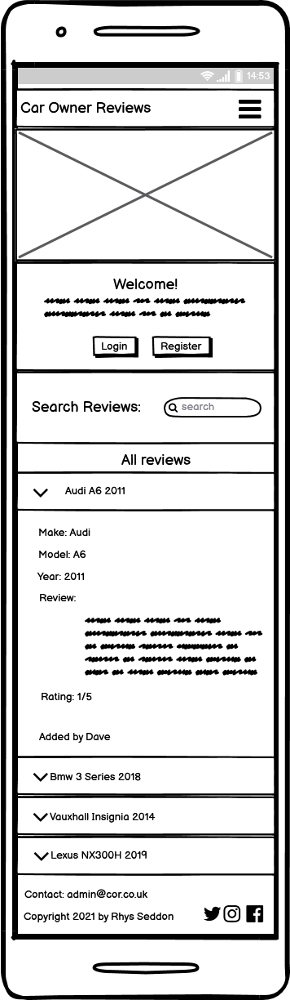
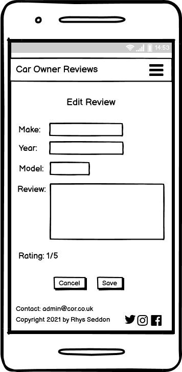

# Car Owners Reviews

## Contents

* [Purpose](#Purpose)
* [User Stories](#User-Stories)
* [UX](#UX)
    * [Strategy](#Strategy)
    * [Scope](#Scope)
    * [Structure](#Structure)
    * [Skeleton](#Skeleton)
    * [Wireframes](#Wireframes)
    * [Surface](#Surface)
* [Features](#Features)
    * [Navbar](#Navbar)
    * [Footer](#Footer)
    * [Home Page](#Home-Page)
    * [Profile Page](#Profile-Page)
    * [New Review Page](#New-Review-Page)
    * [Login Page](#Login-Page)
    * [Register Page](#Register-Page)
    * [Edit Page](#Edit-Page)
    * [Manage Reviews Page](#Manage-Reviews-Page)
    * [Features To Add In The Future](#Features-To-Add-In-The-Future)

## Purpose

The purpose of this website is to give users an insight into what it is like to own a particular car. 
Cars are one of the biggest purchases people make in their lives and they will normally want to make 
sure they are buying the right one!  
The website will be based on members submitting reviews of cars they own or have previously owned, 
this will give users an impartial view from people who have had the experience of owning the car and 
are not just trying to sell it for a profit.  
The reason for creating this project is for my third milestone project for a software development course
 I am undertaking with the Code Institute.

## User Stories

### Visiting users

As a visiting user I want to:
-	"Instantly understand the purpose of the website"
-	"Be able to swiftly decipher site navigation."
-	"Find out how good a particular car is?"
-	"Be able to search easily to find if there is a review on the car, I am interested in."
-	"Be able to register and become a member to post my own review."

### Returning users

As a returning user I would like to:
-	"Be able to login and see my profile."
-	"Be able to delete and edit my old reviews."
-	"Write a new review."
-	"Be able to log back out again."

### Admin users

As an admin user I require the ability to:
-   "Log in as an admin user."
-   "Delete or edit all member reviews."
-   "Search all members reviews."
-   "Create, edit and delete the makes of the cars"

# UX

## Strategy

As the site owner my goal is to create a place for car owners to share their experience of owning a particular car and provide this information clearly to other users of the site.  To achieve this, I aim provide users with the ability to:
-	Add their own reviews.
-	Browse other users’ reviews.
-	Search other users’ reviews.
The target audience for the site will be:
-	Users that want to inform everyone of how good or bad their car is.
-	Users that are looking to buy a new car and require impartial information.
-	Users who have a general interest in cars.

### User Expectations

The user should:
-	Be able to navigate the site easily.
-	Expect the site to load quickly.
-	Read other users reviews.
-	Create, read, update and delete their own reviews.

## Scope

Based upon the strategy the features and functionality I want to include are as follows:
-	Car related hero image
-	A paragraph welcoming the user and explaining the websites purpose.
-	Ability to register, login and logout.
-	A search box where the user can search for reviews.
-	An accordion containing all the reviews so the user can browse through them.
-	An accordion containing the current profile owners’ reviews.
-	Ability for the user create, read, edit or delete their reviews.
-	A form for the user to fill out containing the make, model, year and review.
-	Ability for the user to rate the car from 0 to 5.
-	A form with the ability to edit make, model, year and review.
-	A page containing all the makes with options to delete or edit them for the admin user.

## Database

To enable create read update an delete functionality the website will require a non-relational data base (No SQL).
The data base will have three collections:

### Users

A document of the registered users. 

Key | Value
---|---
_id |ObjectId  
username | string  
password | string

### Reviews

A document of reviews written by the users. Accessible by admin and partially by registered users. 

Key | Value
---|---
_id |ObjectId 
make | string
model | string
year | int
review | string
rating | int
owner | string

### Makes

A document of makes added by admin users. Only accessible by admin.

Key | Value
---|---
_id |ObjectId 
make | string

### Database Schema

## Structure

The site will be structured in a linear format keeping the users’ expectations as the main priority. 
It will contain 8 pages each with the same navbar and footer. The layout will be similar across all pages 
to keep a consistent and clean UX.

## Skeleton 

### Wireframes

#### Desktop

Desktop Home (Click for image)

Desktop Profile (Click for image)

Desktop New Review (Click for image)

Desktop Login (Click for image)

Desktop Register (Click for image)

Desktop Edit Review (Click for image)

Desktop Manage Makes (Click for image)

Desktop Edit Makes (Click for image)

#### Tablet

Tablet Home (Click for image)

Tablet Profile (Click for image)

Tablet New Review (Click for image)

Tablet Login (Click for image)

Tablet Register (Click for image)

Tablet Edit Review (Click for image)

Tablet Manage Makes (Click for image)

Tablet Edit Makes (Click for image)

#### Mobile

Mobile Home (Click for image)

Mobile Profile (Click for image)

Mobile New Review (Click for image)

Mobile Login (Click for image)

Mobile Register (Click for image)

Mobile Edit Review (Click for image)

Mobile Manage Makes (Click for image)

Mobile Edit Makes (Click for image)

## Surface

### Theme

The website will have an automotive theme that will need to look modern and not too cluttered 
to maintain a clean user experience.  

### Typography

The font for the title, navbar and heading will be 'Faster One' to give the site its 'automotive' feel. 
The rest of the site will have the font 'Contrail One' as its still has an 'automotive' feel to it but
will be much clearer than 'Faster One' in the small font sizes.

### Colour Scheme

Functional and modern colour scheme, with a white background to keep clean UX.

## Features

### Navbar

-	All pages will contain the navbar.
-	Page name on the left-hand side.
-	Navigation links on the right-hand side.
-	Navbar colour will be materialize class colour teal darken-2.
-	The navbar links will differ depending on if and who is logged in and on what page. (see each page)

### Footer

-	All pages will contain the same footer.
-	Containing contact and copyright information on the left and social media links on the right.

### Home Page

-	Car related full width hero image at the top of the page.
-	A paragraph welcoming the user and explaining the websites purpose with buttons to register and login below.
-	A search box with the title “search reviews”, where the user can search through all reviews.
-	An accordion with the title “All Reviews” containing all the reviews so the user can browse through them.
-	Each dropdown will have the title of the make and model of car and the year.
-	Each dropdown will contain the information:
    * Make
    * Model
    * Year
	* Review
	* Rating out of 5.

Nav Links:  
Logged out – Home | Login | Register.  
Logged in – Home | Profile  | New Review | Logout.  
Admin – Home | Profile | New Review | Manage Makes | Logout.

### Profile Page

-	Main title of Users Profile and below to the left “Your Reviews” 
-	Accordion containing the current profile owners’ reviews.
-	Each dropdown will have the title of the make and model of car and the year.
-	Each dropdown will contain the information:
    * Make
    * Model
    * Year
	* Review
	* Rating out of 5.
-	Buttons so they can edit and delete their reviews on the accordion.
-	Central button below that links to new review page.

Nav Links:  
Logged in – Home | Profile | New Review | Logout.  
Admin – Home | Profile | New Review | Manage Makes | Logout.

### New Review Page

-	Title of “New Review”
-   Review form for the user to fill out containing:
    *   A dropdown containing all the car makes for the user to select.
    *   Model input field.
    *   Year input field.
    *   Review input field.
    *	Input field for the user to rate the car from 0 to 5.
    *	A central save button below.

Nav Links:  
Logged in – Home | Profile | New Review | Logout.  
Admin – Home | Profile | New Review | Manage Makes | Logout.

### Login Page

-	Title of “Login”
-	Central container with 2 text boxes for the user to enter their username and password.
-	Text boxes will have the labels username and password with suitable icons on the left of the labels.
-	Login button.
-	A link to register if not already registered.

Nav links:  
Logged out – Home | Login | Register.

### Register Page

-	Title of “Register”
-	Central container with 2 text boxes for the user to enter their username and password.
-	Text boxes will have the labels username and password with suitable icons on the left of the labels.
-	Save button.
-	A link to login if already registered.

Nav links:  
Logged out – Home | Login | Register.

### Edit Review Page

-	Title of “Edit Review”
-   Prefilled edit form for the user to edit containing:
    *   A dropdown containing all the car makes for the user to select.
    *   Model input field.
    *   Year input field.
    *   Review input field.
    *	Input field for the user to rate the car from 0 to 5.
    *	A central save and cancel button below.

Nav Links:  
Logged in – Home | Profile | New Review | Logout.  
Admin – Home | Profile | New Review | Manage Makes | Logout.

### Manage Makes Page (Admin Only)

-	Title of “Manage Makes"
-	Sub heading "Add New Make"
-   Central text input to insert a new make.
-   Central "Save Make" button.
-   Sub Heading "Edit Make"
-   Card Panels containing all of the makes in the DB.
-   Edit and delete button inside each card panel.

Nav Links:  
Admin – Home | Profile | New Review | Manage Makes | Logout.

### Edit Makes Page

-  Title of "Edit Makes".
-  Prefilled text input (with the selected make that they wanted to edit).
-  Central cancel and save buttons.

Nav Links:  
Admin – Home | Profile | New Review | Manage Makes | Logout.

### Modal 

- When deleting makes or reviews users should be prompted with a pop up modal.
- The modal should contain the title "Are You Sure You Want To Delete?"
- Centralised cancel and delete buttons.

### Features To Add In The Future
-	The ability to upload pictures to the profiles, these could be of the car or the user or both.
-	Star rating system where user can click a radio button of stars 1 to 5. 
-	Users ability to see previously owned cars of each reviewer so they can gauge the prior knowledge of the reviewer. 

