# Testing

## Testing Contents
- [Manual Test Cases](#Manual-Test-Cases)
    * [Favicon](#Favicon)
    * [Font](#Font)
    * [Navbar](#Navbar)
    * [Footer](#Footer)
    * [Footer](#Footer)
    * [Home Page](#Home-Page)
    * [Register Page](#Register-Page)
    * [Login Page](#Login-Page)
    * [Profile Page](#Profile-Page)
    * [New Review Page](#New-Review-Page)
    * [Edit Review Page](#Edit-Review-Page)
    * [Manage Makes Page](#Manage-Makes-Page)
    * [Edit Make Page](#Edit-Make-Page)
    * [403 Error](#403-Error)
- [Completed Testing](#Completed-Testing)
    * [Browsers](#Browsers)
    * [Friends and Family](#Friends-and-Family)
    * [Mobile Friendly Test](#Mobile-Friendly-Test)
    * [User Story Testing Outcomes](#User-Story-Testing-Outcomes)
- [Fixed Bugs](#Fixed-Bugs)
- [Outstanding Bugs](#Outstanding-Bugs)

#### Return to [README.md](README.md)

## Manual Test Cases

For testing as admin user, please use:

- Username: admin
- Password: admin

### Favicon
- A red car must display as the favicon once the page has loaded.

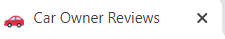

### Font
- The font 'Faster One' must be the font used on all titles and headings throughout the site. 
- The font 'Contrail One' must be the font used in all other areas of the site.

### Navbar

Display:
- "CAR OWNER REVIEWS" title on left hand side.
- Links on right hand side.

- On screen sizes less than 998px navigation links must collapse into burger icon and when selected 
must display as a side nav.

Side Nav Screenshot (Click for image)

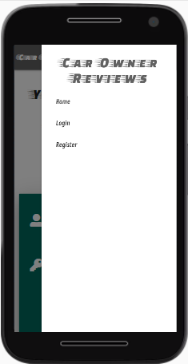

- For non logged in users nav links must display HOME | LOGIN | REGISTER
- For logged in users nav links must display  HOME | PROFILE | NEW REVIEW | LOGOUT
- For logged in admin users nav links must display  HOME | PROFILE | NEW REVIEW | MANAGE MAKES | LOGOUT
- Navbar must display the same across all pages.  

Functionality for both top nav and side nav links:  

- HOME is selected all users must be directed to home page.
- LOGIN is selected all users must be directed to login page.
- RESISTER is selected all users must be directed to register page.
- PROFILE is selected all logged in users must be directed to profile page.
- LOGOUT is selected all logged in users must be directed to login page and a flash message 
must appear with the message "YOU HAVE BEEN LOGGED OUT".  

- NEW REVIEW is selected all logged in users must be directed to new review page.
- MANAGE MAKES is selected logged admin in users must be directed to manage makes page.
- Functionality must remain the same across all pages.

### Footer

Display:

- Must display "Contact: Admin@carowners-rhys.com" on the top left side.
- Must display "Copyright 2021 Rhys Seddon" on the bottom left side.
- Facebook, Instagram and Twitter logos must display on the right side.
- Footer must display the same across all screen sizes and pages.

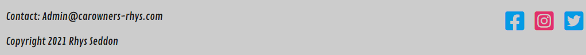

Functionality:

- Facebook logo selected must redirect to facebook.com in a new browser window.
- Instagram logo selected must redirect to Instagram.com in a new browser window.
- Twitter logo selected must redirect to Twitter.com in a new browser window.

### Home Page

Display:

- The full width hero image must display below the navbar.

Background Image (Click for image)

- Below hero image Welcome section must display on left and search bar on right.  
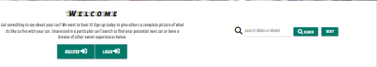

- Welcome section must display above search bar on mobile screen sizes.  

Welcome Section Mobile Screenshot (Click for image)

- Welcome section must display the heading "WELCOME" with a paragraph of information 
and a register and login button below.

Welcome Section Screenshot (Click for image)

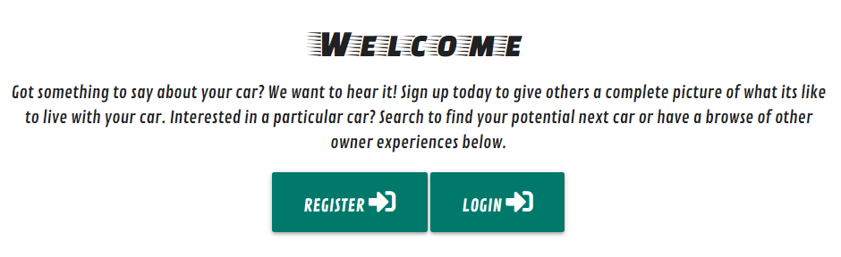

- Search bar must display a magnifiying glass icon, a text input area with the
 placeholder "Search make or model" and a "search" and "reset" button.  
 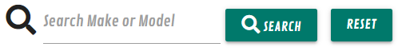

 - All reviews section must display a central title "ALL REVIEWS".
 - A dropdown accordion containing the reviews must display below.
 - Each accordion section header must contain a down arrow icon, the make, model, year and creator of the 
 review (owner)
 - When each header is selected a dropdown must appear below containing: Make, Model, Year, Review, Rating
 and Owner fields. 
 - For admin users "EDIT" button and "DELETE" buttons must also display on the accordion. 

All reviews Screenshot (Click for image)

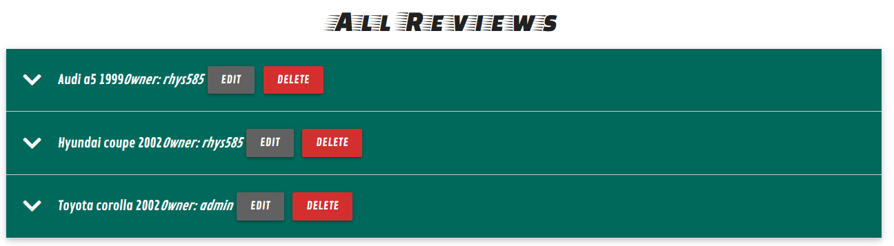

- When there are no reviews in the database, in the place of the accordion a message will appear
 "NO REVIEWS FOUND".

Functionality:

- The welcome section "REGISTER" button when selected must redirect all users to the register page"
- The welcome section "LOGIN" button when selected must redirect all users to the login page"
- The search bar must search for any make or model key word in any of the reviews and those reviews
must then appear in the accordion below.
- If the search obtained no results in the place of the accordion a message "NO REVIEWS FOUND" must 
appear.
- If the user inputs less than 3 letters they must be given a warning displaying "Please lengthen this 
text to 3 characters or more (you are currently using *no. of characters* characters").
- If the "RESET" button is selected the page must revert back to all reviews (if any) displaying.
- When "EDIT" is selected on the review accordion admin users must be redirected to prefilled 
edit page.
- When "DELETE" is selected, the delete popup modal must appear.
- If "DELETE" is again selected on the modal, the corresponding review must be permanently deleted from the accordion 
and the database.
- If "CANCEL" is selected, it must revert back to the all reviews page.

 

Delete Modal Screenshot (Click for image)

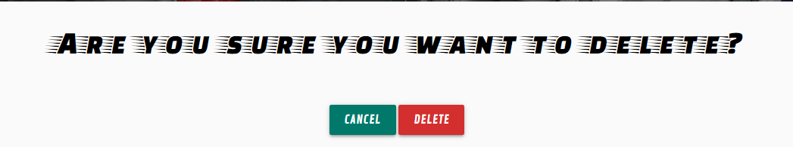

### Register Page

Display:

- Must retain the basic layout and remain responsive on all screen sizes.
- Must have the central title "REGISTER"
- Central card panel form should display.
- Username input with icon and placeholder "Please enter a username - between 5 and 12 characters"  
- Password input with icon and placeholder "Please enter a password - between 5 and 12 characters"
- Central "REGISTER" button.
- Below card panel centrally must read "Already Registered? Login Here" and the "Login Here" text 
must display as a link.  

 

Register Screenshot (Click for image)

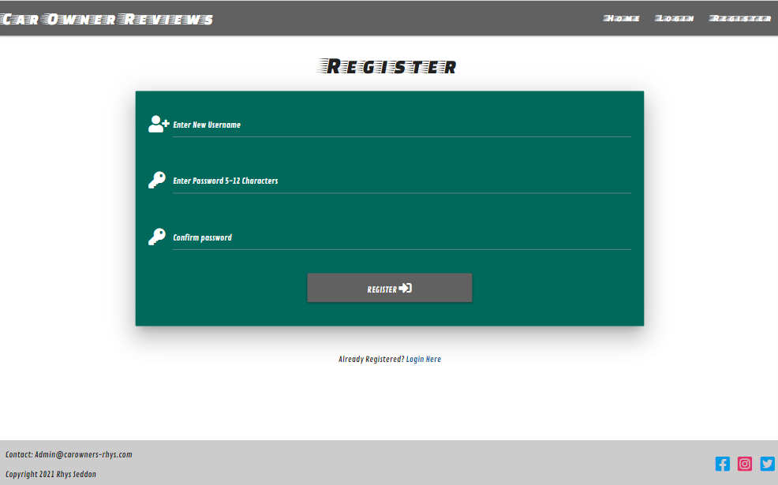

Functionality:

- The username and password input fields must only allow 12 characters to be entered.
- If less than 5 characters are entered the below line must turn red and when the 
register button is selected a warning will appear that reads: "Please match the format requested".
- If both fields are correctly completed the below lines will turn green, the user will be
redirected to the profile page and a flash message must appear: "WELCOME TO THE CLUB!"  

- Testing must be now carried out by selecting "LOGOUT" in the navbar, then the previous username 
and password re entered to check if the registration has been successful.
- The "Login Here" link below must redirect to login page.

### Login Page

Display:

- Must retain the basic layout and remain responsive on all screen sizes.
- Must have the central title "LOGIN"
- Central card panel form must display.
- Username input with icon and placeholder "Please enter a username - between 5 and 12 characters"  
- Password input with icon and placeholder "Please enter a password - between 5 and 12 characters"
- Central "LOGIN" button.
- Below card panel centrally must read "Not Registered? Register Here" and the "Register Here" text 
must display as a link.  

 

Login Screenshot (Click for image)

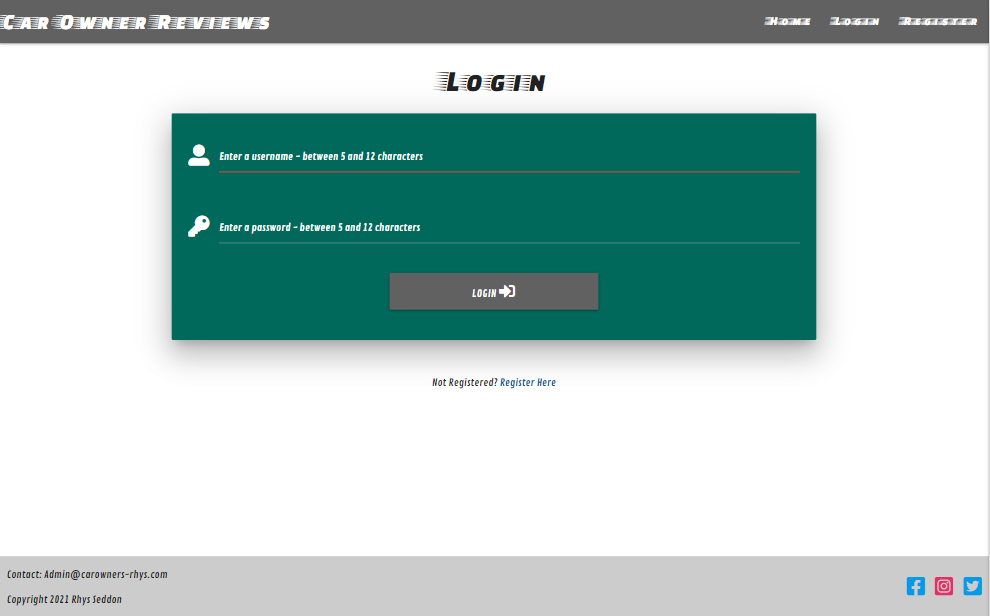

Functionality:

- The username and password input fields must only allow 12 characters to be entered.
- If less than 5 characters are entered the below line must turn red and when the 
login button is selected a warning will appear that reads: "Please match the format requested".
- If both fields are correctly completed the below lines will turn green, the user will be
redirected to the profile page and a flash message must appear: "WELCOME *username*"  

- The "Register Here" link below must redirect to login page.

### Profile Page

Display:

- Must retain the basic layout and remain responsive on all screen sizes.
- The page heading must display "*username*'s Profile".
- The sub heading must display "Your Reviews"
- A dropdown accordion containing the users reviews must display below.
- Each accordion section header must contain a down arrow icon, the make, model and year.
- When each header is selected a dropdown must appear below containing: Make, Model, Year, Review
and rating.
- "EDIT" and "DELETE" buttons must also display on the accordion header.
- When there are no reviews in the database, in the place of the accordion a message must appear
 "NO REVIEWS FOUND".
- Below the accordion a central button "ADD NEW REVIEW" with a plus icon.

Profile Screenshot (Click for image)

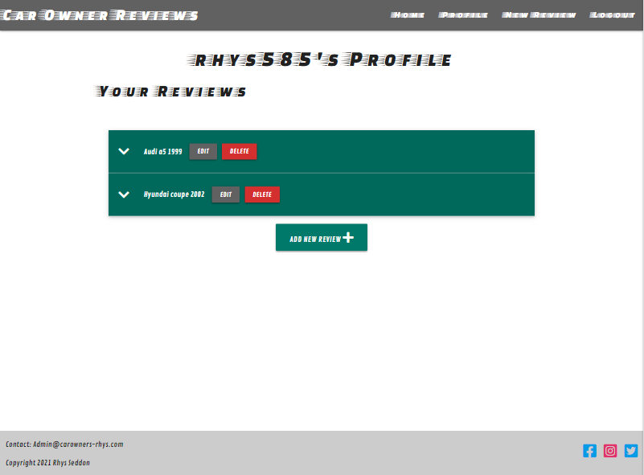

Functionality:

- When "EDIT" is selected on the review accordion users must be redirected to prefilled 
edit page.
- When "DELETE" is selected, the delete popup modal must appear.
- If "DELETE" is again selected on the modal, the corresponding review must be permanently deleted from the accordion 
and the database. 
- If "CANCEL" is selected, it must revert back to the all reviews page.
- If "ADD NEW REVIEW" is selected users must be directed to the new review page.

### New Review Page

Display:

- Must retain the basic layout and remain responsive on all screen sizes.
- Must display the heading "NEW REVIEW"
- A card panel from must display with a Make dropdown field. Followed by text input fields for:
Model, Year with "YYYY" placeholder, Review and rating 0-5.
- A central "SAVE" button with save icon.

New Review Screenshot (Click for image)

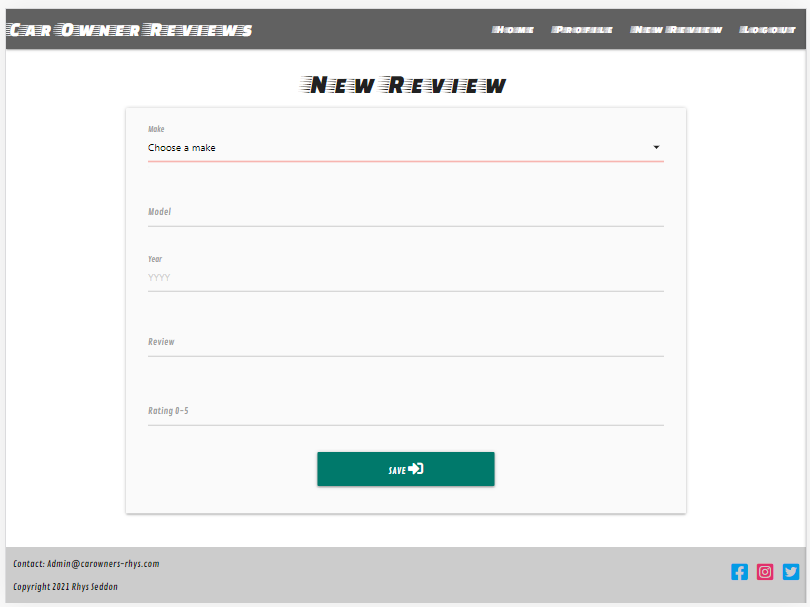

Functionality:

- The Make dropdown field must have the placeholder "Choose a make" and must contain all the makes
held in the database.
- When a make is selected it must appear in the dropdown and a green line must appear below.
- The model text input field must only allow 20 characters to be entered.
- The model text input field must underline in green if less than 20 characters are entered.
- The year input field must underline in red if anything other than 4 numbers is entered.
- The year input field must underline in green if 4 numbers are entered.
- The review input field must only allow 200 characters to be entered.
- The review input field must underline in red if less than 5 characters are entered.
- The rating input field must underline in red if anything other than 1 number 0 - 5 is entered.
- When the "SAVE" button is selected - if any of the input fields are underlined in red, a warning must 
flash with "Please match the format requested".
- If any field is selected and left unfilled, when selecting elsewhere that field must underline in red. 
- When the save button is selected - if any of the fields are empty, a warning must flash with 
" Please fill in this field". Or if the drop down is empty "Please select an item in the list"
- If all of the fields are underlined in green, and the "SAVE" button is selected, the data from each field 
must be saved to the database and the user must be re-directed to the home page with 
a message: "REVIEW SUCCESSFULLY ADDED".
- The review data must now appear in the users profile accordion and on the homepage accordion.

### Edit Review Page

Display:

- Must retain the basic layout and remain responsive on all screen sizes.
- Must display the heading "EDIT REVIEW"
- A pre-filled card panel from must display containing the data from the review the user wished to edit.
- The card panel must contain Make (dropdown field). Followed by text input fields for:
Model, Year with "YYYY" placeholder, Review and rating 0-5.
- A central "SAVE" button with save icon and "CANCEL" button with cancel icon.

Edit Review Screenshot (Click for image)

Functionality:

- The form must be pre filled with the data from the review the user wished to edit.
- The Make dropdown field must have the placeholder "Choose a make" and must contain all the makes
held in the database.
- When a make is selected it must appear in the dropdown and a green line must appear below.
- The model text input field must only allow 20 characters to be entered.
- The model text input field must underline in green if less than 20 characters are entered.
- The year input field must underline in red if anything other than 4 numbers is entered.
- The year input field must underline in green if 4 numbers are entered.
- The review input field must only allow 200 characters to be entered.
- The review input field must underline in red if less than 5 characters are entered.
- The rating input field must underline in red if anything other than 1 number 0 - 5 is entered.
- When the "SAVE" button is selected - if any of the input fields are underlined in red, a warning must 
flash with "Please match the format requested".
- If any field is selected and left empty, when selecting elsewhere that field must underline in red. 
- When the save button is selected - if any of the fields are empty, a warning must flash with 
" Please fill in this field". Or if the drop down is empty "Please select an item in the list"
- If all of the fields are underlined in green, and the "SAVE" button is selected, the data from each 
field must be saved to the database and the user must re-direct to the users profile page with a 
message: "REVIEW SUCCESSFULLY EDITED".
- The review data must now appear in the users profile accordion and on the homepage accordion.

- If the "CANCEL" button is selected the user should be re-directed to the profile page. 

### Manage Makes Page 

- Manage makes page is only accessible as an admin user. To login as admin user please use:
    * username: admin
    * password: admin

- Display:

- Must remain responsive on all screen sizes.
- Must display the heading "MANAGE MAKES".
- Subheading must display the text "ADD NEW MAKE".
- Central text input with place holder "New Make".
- Central button "SAVE MAKE" with save icon.

Add New Make Screenshot (Click for image)

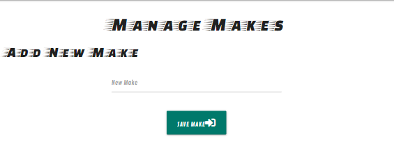

- Below add new make section, subheading to read "EDIT MAKE".
- Card panels - each containing a make from the database and an "EDIT" and "DELETE" button.
- In desktop and tablet view the card panels should display in rows of 4.

Desktop and Tablet Card Panel Screenshot (Click for image)

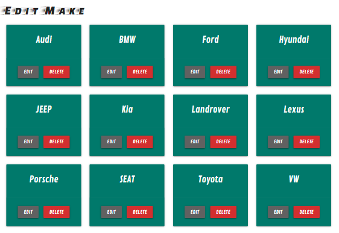

- In mobile view 1 card panel per line.

Mobile Card Panel Screenshot (Click for image)

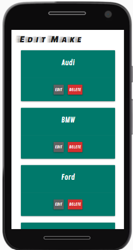

Functionality:

- The New Make text input field must only allow 15 characters to be entered.
- If the New Make text input field is left empty, it must underline in red.
- If the New Make text input field is left empty and the "SAVE MAKE" button selected, a warning must flash
 "Please fill in this field".
- When the New Make text input field is entered correctly it should underline in green.
- When the New Make text input field is entered correctly and the "SAVE MAKE" button selected - The new make
is added to the database and must appear in a card panel below and a message above should appear with "NEW
 MAKE ADDED"
- The make must also appear on the new review page and the edit review page in the "Make" dropdown.

- When "EDIT" is selected in an edit make card panel, the admin user should be re-directed to the edit makes 
page.
- When "DELETE" is selected, the delete popup modal must appear.
- When "DELETE" is again selected on the modal, the corresponding make card panel must be deleted off the page and
permanently deleted from the database.
- The make should also now have also been deleted from the new review page and the edit review page in the 
"Make" dropdown.
- If "CANCEL" is selected, it must revert back to the manage makes page.

### Edit Make Page

Display:

Edit Make Screenshot (Click for image)

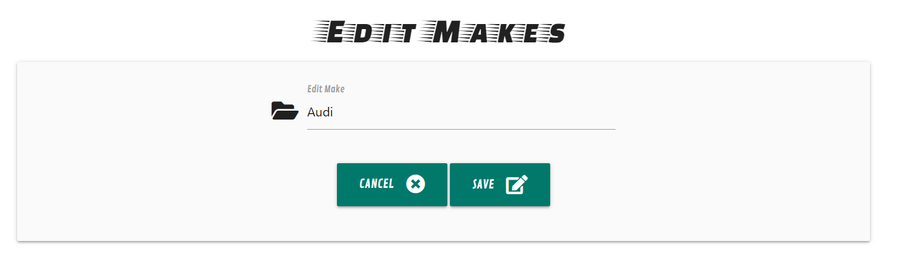

- Must display heading "EDIT MAKES".
- Card panel should display below with "Edit Make" text input.
- Text input must be pre-filled with the make the admin user chose to edit. 
- Text input must only allow maximum of 15 characters.
- When the text input is left empty, it must underline in red. 
- When the text input is left empty and the "SAVE" button selected a warning should flash "Please fill 
in this field".
- When the "CANCEL" button is selected the make must remain unchanged and the admin user must be 
re-directed to the manage makes page.
- When the "Edit Make" text input is correctly entered it must underline in green.
- When the "Edit Make" text input is correctly entered and the "SAVE" button selected the user
should be re-directed to the manage makes page and the corresponding make must be edited and a above
flash message must appear: "MAKE SUCCESSFULLY EDITED"
- The make should also now have also been edited in the new review page and the edit review page 
in the "Make" dropdown.

### 403 Error

To test the 403 error: 
 1. Login as a user.
 2. Copy the URL from the browser.
 3. Select "LOGOUT" in the navbar.
 4. Paste the URL into the browser.
 5. 403 Error page should appear with the heading "FORBIDDEN ERROR 403"
 6. Repeat steps 1 to 5 pasting the URL on the homepage and the register page.

## Completed Testing

### Manual Test Case

The manual test case detailed above was completed successfully.

### Devtools

The website was extensively tested for responsiveness in Google Chrome Devtools on the following devices:

- Moto G4
- Galaxy S5
- Pixel 2
- Pixel 2 XL
- Phone 5/SE
- Phone 6/7/8
- Phone 6/7/8 Plus
- Phone X
- Ipad
- Ipad Pro
- Surface Duo
- Galaxy Fold

## Browsers

The website was tested for responsiveness on the following browsers:

- Google Chrome
- Safari
- Microsoft Edge
- Firefox

## Friends and family

I requested some feedback from friends and family on the how the website displays on their devices. It was thereby sucessfully tested on iPhone 7, iPhone 8,
 iPhone X, iPad, two makes of laptop computer and one desktop this covered Chrome, Microsoft Edge and Safari. 

## Mobile Friendly Test

- Passed the Google mobile friendly test.

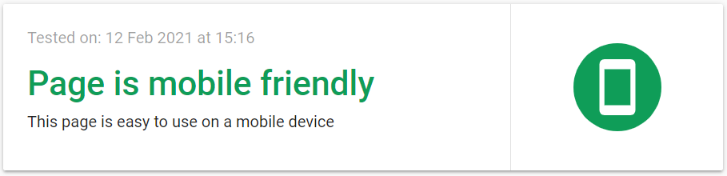

## User Story Testing Outcomes

### Visiting User

- "Instantly understand the purpose of the website"

On the home page of the site the user is welcomed and informed of the service the site it providing.

Welcome Section Screenshot (Click for image)

- "Be able to swiftly decipher site navigation."

The site uses a standard navigation found on most websites and is clearly laid out and not 
too cluttered.

Side Nav Screenshot (Click for image)

- "Find out how good a particular car is?"

Users have the ability to browse or search through the reviews to find how good a particular car is.

- "Be able to register and become a member to post my own review.

Users are told in the Welcome section how they can register and they then have the ability to
post their own review.

### Returning Users

- "Be able to login and see my profile."

Returning users have the ability to log in and see their profile.

- "Be able to delete and edit my old reviews."

Returning users have the ability to delete and edit their old reviews.

Delete Modal Screenshot (Click for image)

Edit Review Screenshot (Click for image)

- "Write a new review."

Returning users have the ability to write a new review.

New Review Screenshot (Click for image)

- "Be able to log back out again."

Users have the ability to logout, by selecting "LOGOUT" on the navbar.  

### Admin

- "Log in as an admin user."

Users have the ability of logging in as an admin user by using username: admin | password: admin.

- "Delete or edit all member reviews."

Admin has the ability to edit all registered user reviews on the home page accordion.

Admin Edit Reviews Screenshot (Click for image)

- "Search all members reviews."

Admin has the ability to search through all reviews on the homepage.  

- "Create, edit and delete the makes of the cars"

Admin has the ability to create, edit and delete the makes of cars on the manage makes page.

Admin Manage Makes Screenshot (Click for image)

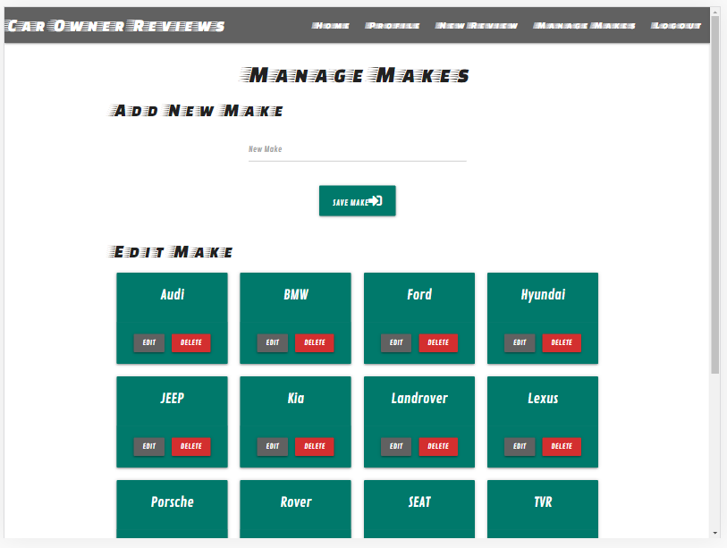

## Fixed Bugs

- On the reviews accordions - the reviews that were longer than the width of the container
were spilling outside of their container instead of creating a new line. Was resolved by
using the Materialize class - `prewrap`.
Credit: [Stack Overflow](https://stackoverflow.com/questions/41081380/white-space-pre-not-working-as-expected)

- The wrong reviews and makes were getting deleted. I found this was due to the modal being 
within the jinja for loop, so added `modal{{loop.index}}` to the modal id so the modal id will 
 increment on each iteration of the jinja for loop.
Credit: [Stack Overflow](https://stackoverflow.com/questions/46033541/flask-template-jinja-not-looping-as-expected)

- Nu HTML validator test had 2 errors relating to the `<main>` semanitc element. "The main element must to appear as a
decendant of the main element" and "A document must not include more than one visible main element". These errors were 
because I had used the main element on the base template and extended that template on the home page where I had also
used the main element. To fix I changed the `<main>` element on the homepage to a `
`.  

Nu HTML check errors (Click for image)

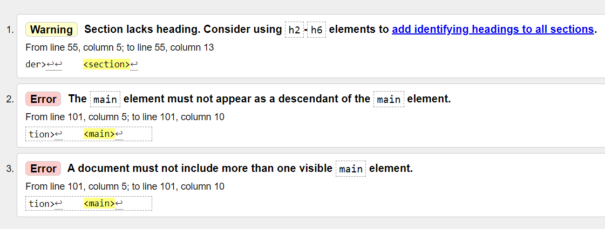

## Outstanding Bugs

- CSS validator found an 1 error. This was unable to be resolved as it was an error from the Materialize CDN.

CSS results (Click for image)

### Return to [README.md](README.md)